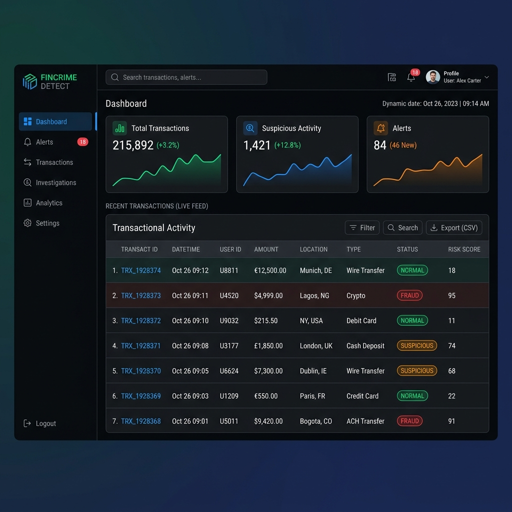
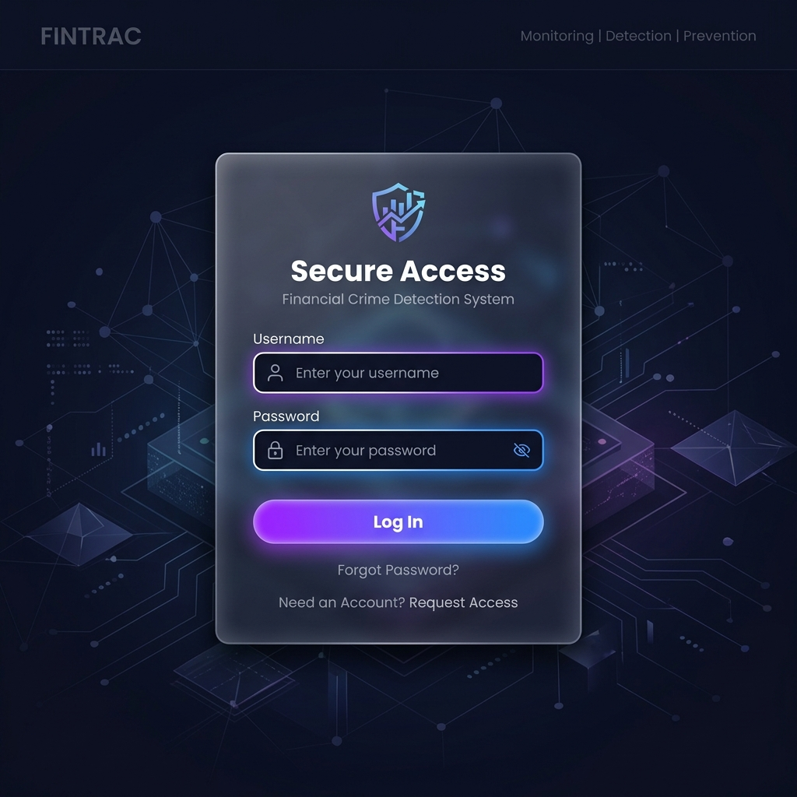

# Financial Crime Detection System

## 📌 Title
Financial Crime Detection System

## 🚨 Problem Statement
Money laundering and financial fraud pose significant threats to the stability and integrity of global financial institutions. Manual monitoring of the sheer volume of daily transactions is practically impossible, often leading to undetected fraudulent activities, high false-positive rates, and delayed responses. Existing legacy systems frequently lack the capability for real-time monitoring and dynamic risk assessment, leaving institutions vulnerable to sophisticated financial crimes.

## 💡 Solution / Features
Our Financial Crime Detection System is a full-stack web application built to monitor financial transactions in real-time, proactively identifying and alerting on potential fraudulent activities.

### Key Features:
- **Real-Time Dashboard**: A clean, responsive interface for compliance officers to monitor transaction flows and system statistics at a glance.
- **Rule-Based Fraud Detection Engine**: Dynamically calculates risk scores based on multiple heuristics:
  - **High-Value Transactions**: Flags amounts exceeding predefined thresholds.
  - **High-Risk Locations**: Monitors transactions originating from blacklisted or high-risk geographic areas.
  - **Suspicious Patterns**: Detects anomalies like unusually large round amounts or high-value transfers/withdrawals.
- **Automated Risk Scoring**: Transactions are scored from `0.0` to `1.0` and automatically classified as `NORMAL`, `SUSPICIOUS`, or `FRAUD`.
- **Alert Generation**: Automatically triggers and stores severity-based alerts (`MEDIUM`, `HIGH`, `CRITICAL`) for immediate review.
- **Secure Authentication**: Robust user authentication and authorization utilizing JWT (JSON Web Tokens) to ensure data privacy and system security.
- **Transaction Simulation**: Built-in form to safely simulate and inject transaction data into the system for testing and demonstration.

## 📸 Screenshots

*Note: These are AI-generated mockups of the application interface for demonstration.*

### Dashboard View

### Secure Login

## 🛠️ Tech Stack
This project leverages a modern, robust, and scalable technology stack:

**Backend:**
- **Java 17**
- **Spring Boot 4.0.5** (Web, Data JPA, Security)
- **JSON Web Tokens (JWT)** for secure API communication
- **MySQL** Database for persistent data storage
- **Maven** for dependency management
- **Lombok** to reduce boilerplate code

**Frontend:**
- **React 19**
- **React Router** for seamless Single Page Application (SPA) navigation
- **Axios** for handling HTTP requests to the REST API
- **HTML5 & CSS3** (Vanilla CSS for custom, vibrant, and dynamic styling)

## ⭐ Unique Points
- **Multi-Heuristic Risk Algorithm**: Unlike simple threshold-based systems, our engine evaluates multiple factors simultaneously to compute a cumulative risk score, reducing false positives.
- **Automated Severity Triage**: Alerts are automatically categorized, allowing compliance teams to prioritize `CRITICAL` threats immediately without manual sorting.
- **Clean Architecture**: The backend strictly follows Controller-Service-Repository patterns, ensuring maintainability and ease of testing.
- **Premium User Experience**: The frontend prioritizes visual excellence with a dynamic, dark-mode, glassmorphic design that feels responsive and professional.

## 🚀 Future Improvements
- **Machine Learning Integration**: Transition from a static rule-based engine to adaptive ML models (e.g., Isolation Forests, Neural Networks) to detect complex, previously unknown fraud patterns.
- **Real-Time Event Streaming**: Implement **Apache Kafka** or **RabbitMQ** to handle high-throughput, asynchronous transaction processing for enterprise-scale deployments.
- **Enhanced Data Analytics**: Incorporate historical reporting, data export features (CSV/PDF), and advanced data visualization charts for deeper insights.
- **Advanced Security Measures**: Add Two-Factor Authentication (2FA) and role-based access control (RBAC) to further secure the platform for compliance officers.
- **Containerization**: Dockerize the application and utilize Kubernetes for automated deployment, scaling, and management.
